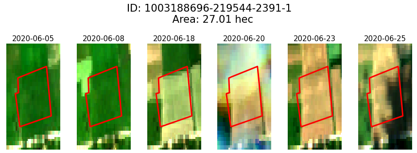
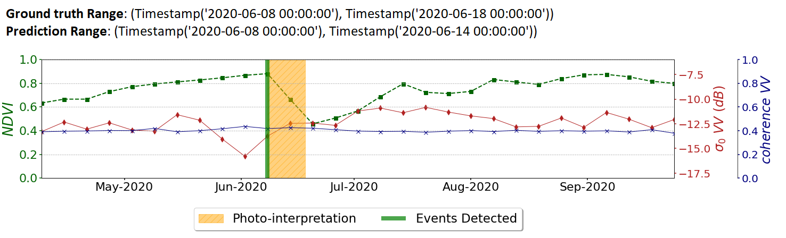

# Deep Learning for Cloud Gap-Filling on Normalized Difference Vegetation Index using Sentinel Time-Series **(TBD)**

## Iason Tsardanidis, Alkividis Koukos, Vasileios Sitokonstantinou, Thanassis Drivas and Charalampos Kontoes

### Abstract 

*The demand for uninterrupted optical time series is essential for the timely monitoring of changes taking place on agricultural land. Nevertheless, the continuity of the Sentinel-2 time-series is often hindered by intense cloud coverage, which is even more of an issue for northern European countries. A collaborative exploitation of both Sentinel-2 observations that are characterized as cloud free and the Sentinel-1 Synthetic Aperture (SAR) measurements which can be provided on a fixed time step can alleviate the current problem. Taking into consideration the ability of Deep Learning architectures to track temporal patterns and identify correlations between optical and SAR data, we apply a CNN-RNN based model that exports dense Normalized Difference Vegetation Index (NDVI) time-series of a static 6- day time resolution. The exported time-series are then applied on the very special case of grassland event detection task. In this study, pixel-level data from 6 different areas of Lithuania extracted using CreoDIAS big data repository for the direct comparison of the most usual gap-filling methodologies and ours on a random selected time frames of variable sizes. In this work it is demonstrated that our model is able to provide dense artificially created NDVI time-series that can be deployed on the context of a fully operational scenario and improve the accuracy of event identification tasks in general. Moreover, it is shown as a robust methodology that can act as a filter that eliminates the abrupt changes and noise of NDVI time series due to cloudy observations that applied masks are frequently not able to detect. Finally this CNN-RNN architecture can be used also for events identification tasks that is trained and evaluated based on photo-interpretation instances collected for the aforementioned regions*

### Sentinel-1/Sentinel-2 Fusion 

The mian purpose of this work is to use efficiently the SAR and InSAR measurements collected in parallel with the available NDVI observations, in order to create fully and dense NDVI series and fill the gaps existed due to the extended cloud coverage.

  

The architecture is based on Convolutional Neural Networks (CNN) and Recurrernt Neural Networks (RNN)

  

### Grassland Mowing Events Detection

  

  

